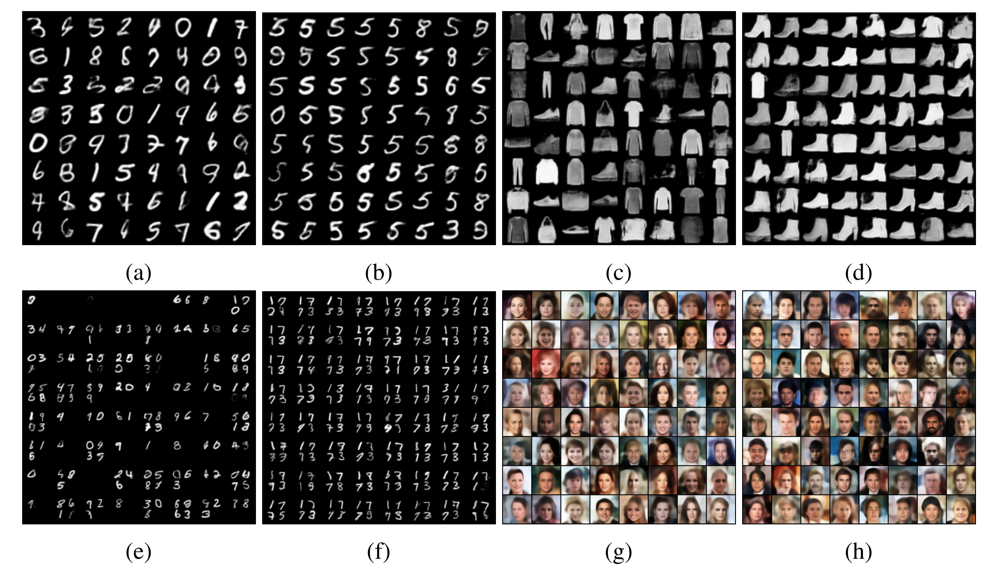
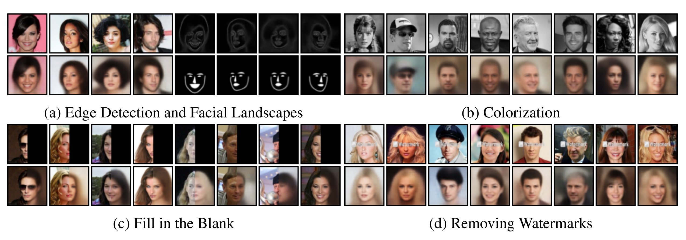

# Multimodal Variational Autoencoder
A PyTorch implementation of *Multimodal Generative Models for Scalable Weakly-Supervised Learning* (https://arxiv.org/abs/1802.05335).

## Setup/Installation

Open a new conda environment and install the necessary dependencies. See [here](https://www.pyimagesearch.com/2017/03/27/how-to-install-dlib/) for more details on installing `dlib`.
```
conda create -n multimodal python=2.7 anaconda
# activate the environment
source activate multimodal

# install the pytorch
conda install pytorch torchvision -c pytorch

pip install tqdm
pip install scikit-image
pip install python-opencv
pip install imutils

# install dlib
brew install cmake
brew install boost
pip install dlib
```

Some additional setup is needed for CelebA-related datasets. Download the aligned-and-cropped version [here](http://mmlab.ie.cuhk.edu.hk/projects/CelebA.html). Also download any annotation information. For the computer vision experiment, we need to precompute a few computations on the CelebA dataset. The dlib model we use to extract landmarks is from a PyImageSearch tutorial. You can download it [here](https://www.pyimagesearch.com/2017/04/03/facial-landmarks-dlib-opencv-python/). After downloading CelebA, try the following:
```
cd vision
# assuming CelebA images are stored in ./data/images
python setup.py grayscale ./data/images ./data/grayscale
python setup.py edge ./data/images ./data/edge
python setup.py mask ./data/images ./data/mask
```

## Example Experiments
This repository contains a subset of the experiments mentioned in the [paper](https://arxiv.org/abs/1802.05335). In each folder, there are 3 scripts that one can run: `train.py` to fit the MVAE; `sample.py` to (conditionally) reconstruct from samples in the latent space; and `loglike.py` to compute the marginal log likelihood `log p(x)` using `q(z|x,y)` as the inference network. 

By default, we anneal KL from 0 to 1. The user can customize the learning rate (`--lr`), number of latent dimensions (`--n-latents`), te annealing rate (`--annealing-epochs`), etc. from the command line. Notably, the user can set `lambda_image` and `lambda_text`, which balance the reconstruction terms. This tends to be important in practice. Training the model will save weights to filesystem. Run `python train.py -h` for details.



### MNIST 
Treat images as one modality and the label (integer 0 to 9) as a second. 

```
cd mnist
CUDA_VISIBLE_DEVICES=0 python train.py --lambda-text 50. --cuda
# model is stored in ./trained_models
CUDA_VISIBLE_DEVICES=0 python sample.py ./trained_models/model_best.pth.tar --cuda
# you can also condition on the label
CUDA_VISIBLE_DEVICES=0 python sample.py ./trained_models/model_best.pth.tar --condition-on-text 5 --cuda
```

### FashionMNIST
Very similar to MNIST, except the labels correspond to categories of fashion items.

```
cd fashionmnist
CUDA_VISIBLE_DEVICES=0 python train.py --lambda-text 50. --cuda
# model is stored in ./trained_models
CUDA_VISIBLE_DEVICES=0 python sample.py ./trained_models/model_best.pth.tar --cuda
# you can also condition on the label
CUDA_VISIBLE_DEVICES=0 python sample.py ./trained_models/model_best.pth.tar --condition-on-text 1 --cuda
```

### MultiMNIST
Again, a MNIST-derivative except each image contains up to 4 digits in fixed locations. The second modality is a string of digits representing the character(s) in the image. We employ an RNN in the label inference network `q(z|y)`.

```
cd multimnist
CUDA_VISIBLE_DEVICES=0 python train.py --lambda-text 10. --cuda
# model is stored in ./trained_models
CUDA_VISIBLE_DEVICES=0 python sample.py ./trained_models/model_best.pth.tar --cuda
# you can also condition on the digits
CUDA_VISIBLE_DEVICES=0 python sample.py ./trained_models/model_best.pth.tar --condition-on-text 1773 --cuda
```

### CelebA
Treat images of celebrity faces as one modality and 18 attributes pertaining to the celebrity (i.e. gender, hair color, etc) as a second modality.

```
cd celeba
CUDA_VISIBLE_DEVICES=0 python train.py --lambda-attrs 10. --cuda
# model is stored in ./trained_models
CUDA_VISIBLE_DEVICES=0 python sample.py ./trained_models/model_best.pth.tar --cuda
# you can also condition on the attribute
CUDA_VISIBLE_DEVICES=0 python sample.py ./trained_models/model_best.pth.tar --condition-on-attrs Male --cuda
```

### CelebA-19
Similar to CelebA except we treat each attribute as its own expert in the product-of-experts. Here we begin to explore more than 2 modalities. See code for an example of the MVAE training paradigm (mentioned in the paper) by sampling multimodal ELBO terms.

```
cd celeba
CUDA_VISIBLE_DEVICES=0 python train.py --lambda-attrs 10. approx-m 1 --cuda
```

Here `approx-m` sets the number of ELBO terms to sample beyond the complete and individual terms.

### Computer Vision Transformations
We learn a series of image processing transformations (i.e. colorization, image completion, edge detciont, watermark removal, and facial landmark segmentation) as modalities. We curate a dataset by applying off-the-shelf tools to CelebA. For simplicitly, in this implementation, we only include the complete ELBO term (using all 6 modalities), and the 6 individual ELBO terms as the objective (in order words `k = 0`). One can also subsample more ELBO terms to better approximate the true MVAE objective (as in `/celeba19/train.py`).

```
cd vision
CUDA_VISIBLE_DEVICES=0 python train.py --cuda
# model is stored in ./trained_models
CUDA_VISIBLE_DEVICES=0 python sample.py ./trained_models/model_best.pth.tar --cuda
# this will reconstruct all the modalities from the image
CUDA_VISIBLE_DEVICES=0 python sample.py ./trained_models/model_best.pth.tar --condition-file <path_to_file> --condition-type image --cuda
# we can also go in the other directions
CUDA_VISIBLE_DEVICES=0 python sample.py ./trained_models/model_best.pth.tar --condition-file <path_to_file> --condition-type watermark --cuda
```



## Questions?
Please report any bugs and I will get to them ASAP. For any additional questions, feel free to email me@mikehwu.com.
